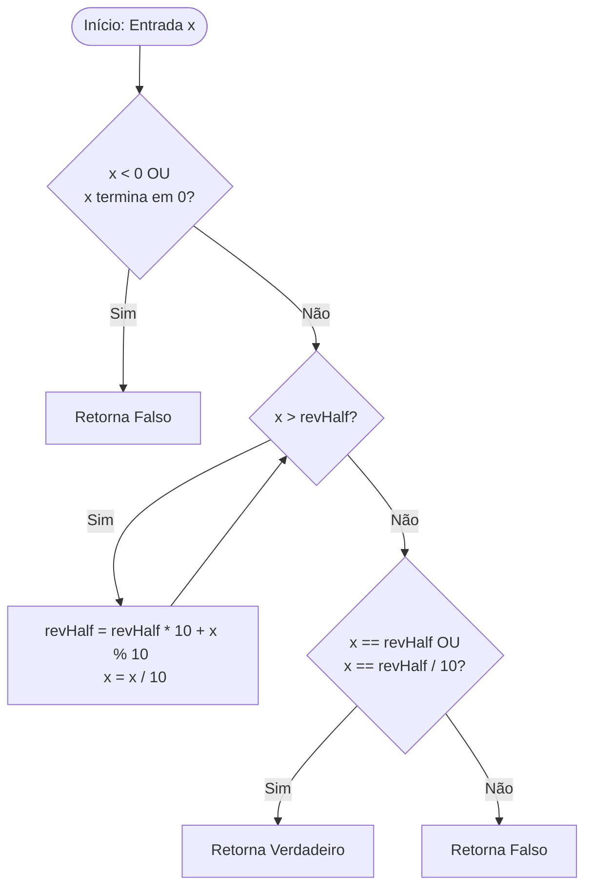

# 🧩 Palindrome Number: Mathematical Approach


Uma solução de alta performance para o clássico desafio de algoritmos, focada em eficiência de memória e otimização matemática sem conversão para strings.

---

## 📖 Sobre o Projeto

Este repositório contém a implementação otimizada para verificar se um número inteiro é um palíndromo. 
O diferencial desta abordagem é a manipulação direta de inteiros, evitando o custo computacional de alocação de memória associado a tipos `string`.

> [!IMPORTANT]
> **A Restrição:** O objetivo é resolver o problema sem converter o número inteiro em uma string, desafiando a lógica de manipulação numérica e controle de *overflow*.

---

## ✨ Funcionalidades

* **Zero String Allocation:** Manipulação puramente matemática.
* **Prevenção de Overflow:** Inverte apenas a metade do número para garantir que o valor caiba em um inteiro de 32 bits.
* **Performance O(log₁₀ n):** Complexidade de tempo logarítmica.
* **Espaço O(1):** Uso constante de memória.

---

## 🛠️ Tecnologia (Built With)

* **C# (.NET Core/Framework)** - Versão de alta performance.

---

## 📐 Fluxo da Lógica (Diagrama)

Abaixo, o fluxo visual da técnica de **Inversão da Metade Direita**:



---

## 💻 Implementação

### C#
```csharp
public bool IsPalindrome(int x) {
    if (x < 0 || (x % 10 == 0 && x != 0)) return false;

    int revHalf = 0;
    while (x > revHalf) {
        revHalf = (revHalf * 10) + (x % 10);
        x /= 10;
    }
    return x == revHalf || x == revHalf / 10;
}
```

---

## 🗣️ Guia de Entrevista (Interview Tips)

> [!TIP]
> **Como explicar este código:**
> 1. **Mencione os Casos de Borda:** Explique por que números negativos e terminados em zero (exceto o próprio zero) são descartados logo de cara.
> 2. **Explique a Inversão Parcial:** Destaque que inverter apenas metade do número economiza processamento e evita *overflow*.
> 3. **Diferencie Par/Ímpar:** Explique que para números ímpares (ex: 121), o dígito central fica no final de `revHalf` e deve ser ignorado na comparação final (`/10`).

---

## 🚀 Como Começar

1. **Clone o repositório:**
   ```bash
   git clone [https://github.com/fernandopbarboza/data-stratuctures-algorithm-csharp.git](https://github.com/fernandopbarboza/data-stratuctures-algorithm-csharp.git)
   ```
2. **Execute o C#:** Abra em qualquer IDE .NET ou use o comando `dotnet run`.

---

## 📜 Licença

Distribuído sob a licença MIT. Veja `LICENSE` para mais informações.